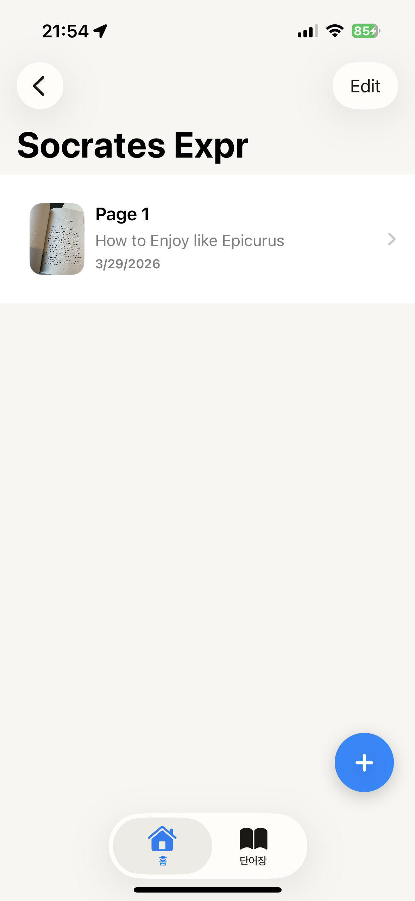
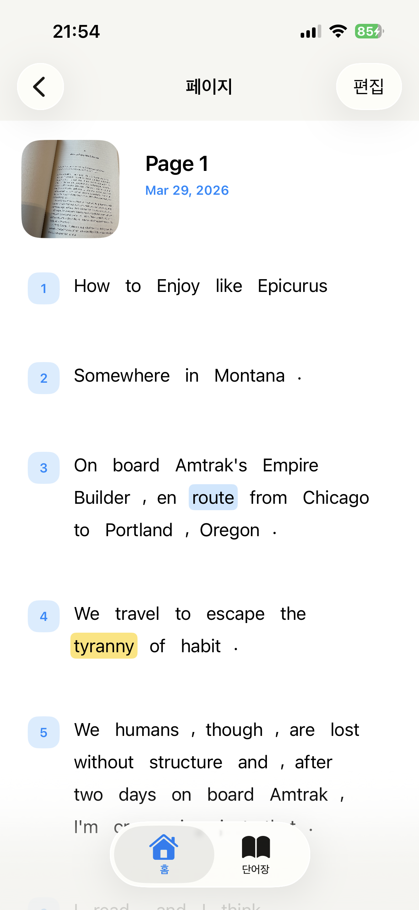
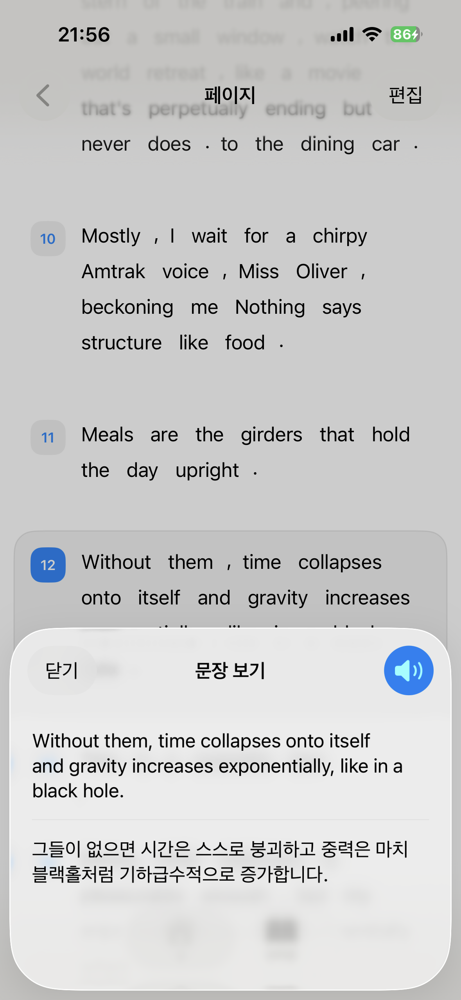
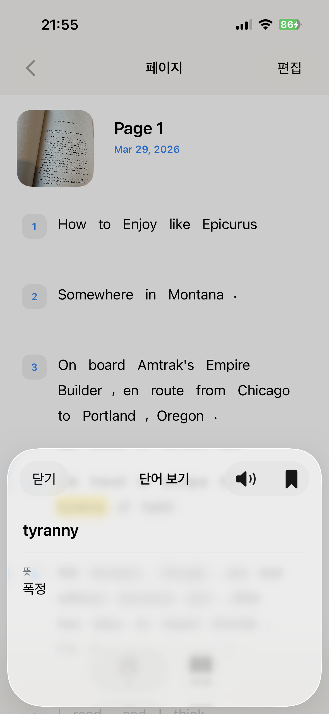
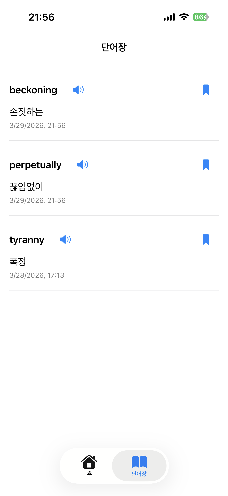

# Lumio

Lumio is an iOS reading companion for English book readers. It helps users capture book pages, extract readable text, translate sentences and words into Korean, and save useful vocabulary for later review.

Lumio는 영어 원서를 읽는 사용자를 위한 iOS 읽기 보조 앱입니다. 책 페이지를 촬영하거나 불러와 텍스트를 추출하고, 문장과 단어를 한국어로 번역하며, 중요한 단어를 저장해 다시 복습할 수 있게 도와줍니다.

## Key Features

- Capture or import English book pages
- Extract sentence-level text from page images with OCR
- Translate sentences and words from English to Korean
- Save words into a personal vocabulary notebook
- Organize saved pages by book

## Screenshots

<table>
  <tr>
    <td align="center"><strong>Books</strong></td>
    <td align="center"><strong>Page List</strong></td>
    <td align="center"><strong>Page Detail</strong></td>
  </tr>
  <tr>
    <td align="center"></td>
    <td align="center"></td>
    <td align="center"></td>
  </tr>
  <tr>
    <td align="center"><strong>Sentence Meaning</strong></td>
    <td align="center"><strong>Word Meaning</strong></td>
    <td align="center"><strong>Vocabulary</strong></td>
  </tr>
  <tr>
    <td align="center"></td>
    <td align="center"></td>
    <td align="center"></td>
  </tr>
</table>

## Read More

- [한국어 README](./README.ko.md)
- [English README](./README.en.md)
